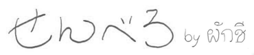
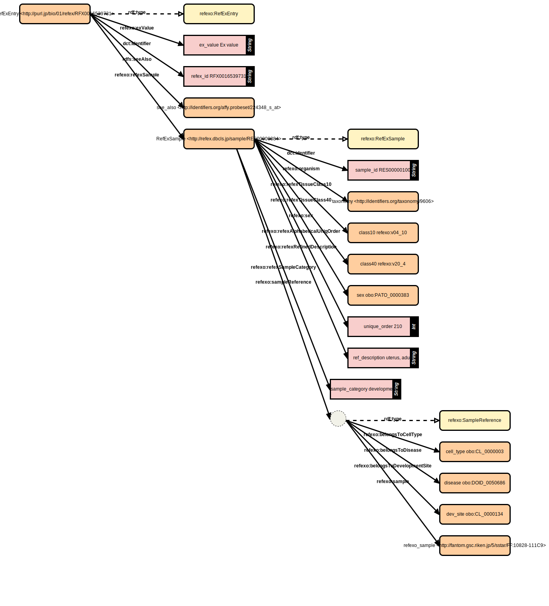

# RDF config (senbero)

RDF-config is a tool to generate SPARQL queries, a schema diagram, and files required for [Grasp](https://github.com/dbcls/grasp), [TogoStanza](http://togostanza.org/) and ShEx varidator from the simple YAML-based configuration files (see the [specification](./doc/spec.md)).



## TODO

* implement
  * support multiple models to be loaded in combination at once
* test

## GOAL

* DONE: capture the RDF data strucuture in ease
* DONE: generate SPARQL queries
* DONE: generate Grasp config file
* DONE: generate schema chart
* DONE: generate TogoStanza
* DONE: generate ShEx for RDF validation (data type and cardinality)
* generate SPARQLet for SPARQList

## SPECIFICATION

* [English version](./doc/spec.md)
* [Japanese version](./doc/spec_ja.md)

## USAGE

### Installation

```
% git clone https://github.com/dbcls/rdf-config.git
% cd rdf-config
% bundle install
```

### Generate schema ascii art

```
% bundle exec rdf-config --config config/refex --senbero
RefExEntry [refexo:RefExEntry] (<http://purl.jp/bio/01/refex/RFX0016539731>)
    |-- refexo:expValue
    |       `-- ex_value ("Ex value")
    |-- dct:identifier
    |       `-- refex_id ("RFX0016539731")
    |-- rdfs:seeAlso
    |       `-- see_also (<http://identifiers.org/affy.probeset/224348_s_at>)
    `-- refexo:refexSample
            `-- sample (RefExSample)
RefExSample [refexo:RefExSample] (<http://refex.dbcls.jp/sample/RES00000100>)
    |-- dct:identifier
    |       `-- sample_id ("RES00000100")
    |-- refexo:organism ?
    |       `-- taxonomy (<http://identifiers.org/taxonomy/9606>)
    |-- refexo:age *
    |       `-- age (obo:PATO_0000383)
    |-- refexo:sex ?
    |       `-- sex (obo:PATO_0000383)
    |-- refexo:developmentalStage *
    |       `-- stage ("adult")
    |-- refexo:refexSampleCategory *
    |       `-- sample_category ("developmental")
    |-- refexo:refexRefinedDescription *
    |       `-- description ("uterus, adult")
    |-- refexo:originalDescription *
    |       `-- original_description ("TPM (tags per million) of Smooth Muscle Cells - Subclavian Artery, donor1.CNhs11090.11289-117A2")
    |-- refexo:refexAlphabeticalUniqOrder ?
    |       `-- unique_order (210)
    |-- refexo:refexTissueClass10 ?
    |       `-- class10 (refexo:v04_10)
    |-- refexo:refexTissueClass40 ?
    |       `-- class40 (refexo:v20_4)
    |-- refexo:sampleReference / refexo:belongsToCellType *
    |       `-- cell_type (obo:CL_0000003)
    |-- refexo:sampleReference / refexo:belongsToDisease *
    |       `-- disease (obo:DOID_0050686)
    |-- refexo:sampleReference / refexo:belongsToDevelopmentSite *
    |       `-- dev_site (obo:CL_0000134)
    `-- refexo:sampleReference / refexo:sample *
            `-- refexo_sample (<http://fantom.gsc.riken.jp/5/sstar/FF:10828-111C9>)
```

### Generate schema diagram

```
% bundle exec rdf-config --config config/refex --schema > refex.svg
```



### Generate SPARQL query

```
% bundle exec rdf-config --config config/refex --sparql sparql
# Endpoint: https://integbio.jp/rdf/sparql
# Description: RDFized reference gene expresson dataset derived from CAGE and GeneChip experiments in the RefEx database.

PREFIX refexo: <http://purl.jp/bio/01/refexo#>
PREFIX dct: <http://purl.org/dc/terms/>
PREFIX rdfs: <http://www.w3.org/2000/01/rdf-schema#>

SELECT ?refex_id ?ex_value ?see_also ?RefExSample ?sample_id ?taxonomy ?age ?stage ?description ?cell_type ?disease ?dev_site ?refexo_sample
WHERE {
    ?RefExEntry a refexo:RefExEntry ;
        dct:identifier ?refex_id ;
        refexo:expValue ?ex_value ;
        rdfs:seeAlso ?see_also .
    ?RefExSample a refexo:RefExSample ;
        dct:identifier ?sample_id .
    OPTIONAL{ ?RefExSample refexo:organism ?taxonomy . }
    OPTIONAL{ ?RefExSample refexo:age ?age . }
    OPTIONAL{ ?RefExSample refexo:developmentalStage ?stage . }
    OPTIONAL{ ?RefExSample refexo:refexRefinedDescription ?description . }
    OPTIONAL{ ?RefExSample refexo:sampleReference / refexo:belongsToCellType ?cell_type . }
    OPTIONAL{ ?RefExSample refexo:sampleReference / refexo:belongsToDisease ?disease . }
    OPTIONAL{ ?RefExSample refexo:sampleReference / refexo:belongsToDevelopmentSite ?dev_site . }
    OPTIONAL{ ?RefExSample refexo:sampleReference / refexo:sample ?refexo_sample . }
}
LIMIT 100
```

By running `--sparql` without an argument, available SPARQL query names will be listed that are defined in the `sparql.yaml` file.

```
% bundle exec rdf-config --config config/mesh --sparql
Usage: --sparql query_name[:endpoint_name]
Available SPARQL query names: sparql, tree_pair, list_qual_for_desc
Available SPARQL query parameters:
  tree_pair: parent_tree_number
Available SPARQL endpoint names: endpoint, med2rdf, integbio
```

If multiple sparql endpoints are provided in the `endpoint.yaml` file, the config (endpoint) name can be specified as `--sparql :endpoint_name` (default endpoint_name is `endpoint`) or in combination with the sparql name as `--sparql sparql_name:endpoint_name`.

```
% bundle exec rdf-config --config config/mesh --sparql :med2rdf
% bundle exec rdf-config --config config/mesh --sparql tree_pair:med2rdf
```

### Generate ShEx

```
% bundle exec rdf-config --config config/nbrc --shex
PREFIX rdf: <http://www.w3.org/1999/02/22-rdf-syntax-ns#>
PREFIX rdfs: <http://www.w3.org/2000/01/rdf-schema#>
PREFIX owl: <http://www.w3.org/2002/07/owl#>
PREFIX xsd: <http://www.w3.org/2001/XMLSchema#>
PREFIX dct: <http://purl.org/dc/terms/>
PREFIX obo: <http://purl.obolibrary.org/obo/>
PREFIX refexo: <http://purl.jp/bio/01/refexo#>
<RefExEntryShape> {
  rdf:type [refexo:RefExEntry] ;
  refexo:expValue xsd:string  ;
  dct:identifier xsd:string  ;
  rdfs:seeAlso IRI  ;
  refexo:refexSample @<RefExSampleShape> 
}
<RefExSampleShape> {
  rdf:type [refexo:RefExSample] ;
  dct:identifier xsd:string  ;
  refexo:organism IRI ? ;
  refexo:age IRI * ;
  refexo:sex IRI ? ;
  refexo:developmentalStage xsd:string * ;
  refexo:refexSampleCategory xsd:string * ;
  refexo:refexRefinedDescription xsd:string * ;
  refexo:originalDescription xsd:string * ;
  refexo:refexAlphabeticalUniqOrder xsd:integer ? ;
  refexo:refexTissueClass10 IRI ? ;
  refexo:refexTissueClass40 IRI ? ;
  refexo:sampleReference BNode 
}
```

### Generate [Grasp](https://github.com/dbcls/grasp) config

```
% bundle exec rdf-config --config config/refex --grasp
Grasp files have been created successfully.
% ls grasp/refex/
query.graphql  schema/
```

### Generate TogoStanza

Note: it may take a while for the first time to install dependencies.

```
% bundle exec rdf-config --config config/hint --stanza hint_pair
Generate stanza: hint_pair
Execute command: npx togostanza generate stanza hint_pair --label "HiNT pair" --definition "Stanza of a protein-protein interaction pair"
? license (MIT): MIT
? author (ktym): Toshiaki Katayama
   create stanzas/hint-pair/README.md
   create stanzas/hint-pair/index.js
   create stanzas/hint-pair/style.scss
   create stanzas/hint-pair/assets/.keep
   create stanzas/hint-pair/templates/stanza.html.hbs

WARNING: Multiple object names (pair0, pair1) are set in the same property path (bp3:participant / obo:BFO_0000051).
Stanza template has been generated successfully.
To view the stanza, run (cd stanza; npx togostanza serve) and open http://localhost:8080/
```

## Run via Docker Container

```
% docker run --rm -it -v <path to config file dir>:/config dbcls/rdf-config:<docker image tag> rdf-config --config /config/<config dir name> [options]
```

See available docker image tags at [Docker Hub](https://hub.docker.com/repository/docker/dbcls/rdf-config/tags?page=1)

## Authors

* Toshiaki Katayama (DBCLS)
* Tatsuya Nishizawa (IMSBIO)

## License

* MIT License
