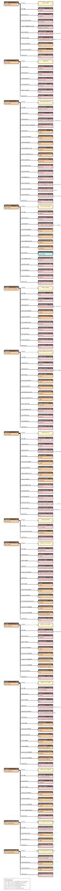
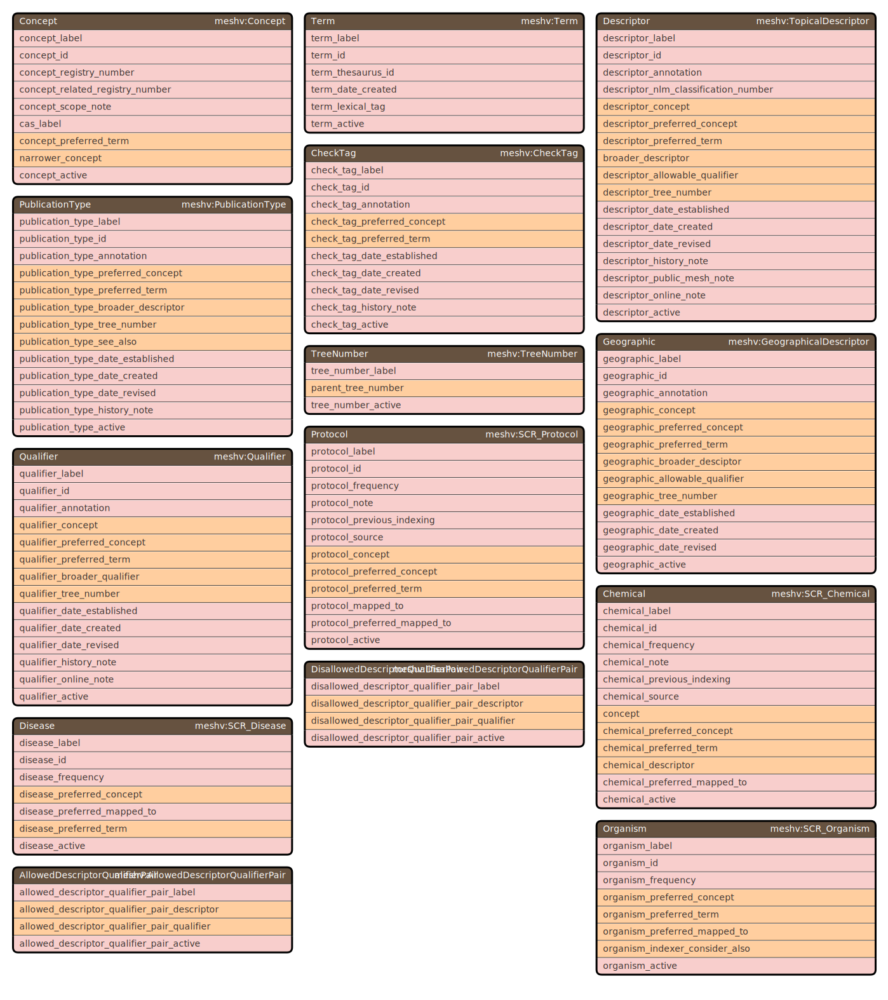
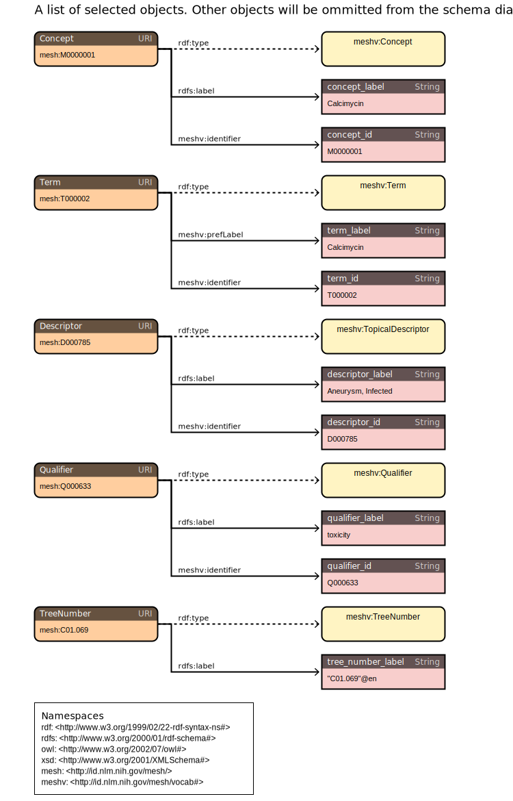
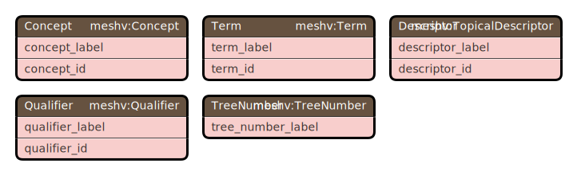
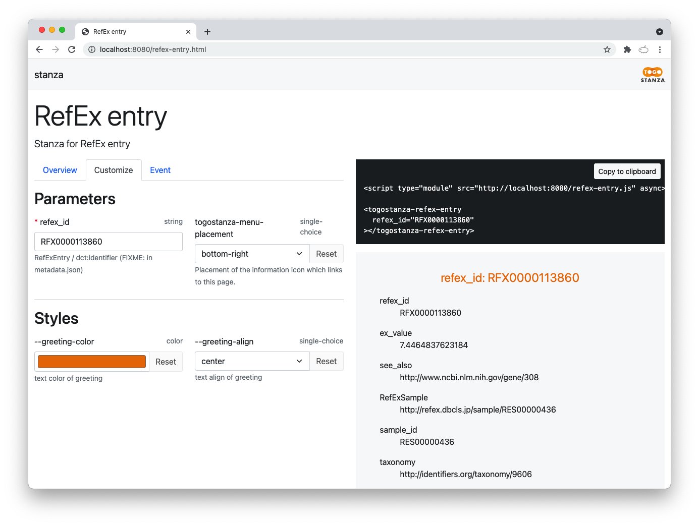

# How to run RDF-config and its execution options

## How to run

```
% rdf-config --config directory_of_config_files execution_options
```

For the `--config` option, specify the directory where the config files are stored.

When using the `--grasp` option, multiple directories can be listed.

## Execution options
| Option | Processing performed |
----|----
| `--sparql [query_name]` | Outputs to standard output the SPARQL query for the query name set in `sparql.yaml`. |
| `--query [variable_name variable_name=value]` | Specifies the list of output variables and VALUES values, and displays the SPARQL query to standard output. |
| `--endpoint [endpoint_name]` | Uses the endpoint name set in `endpoint.yaml` for `--sparql` or `--query`. |
| `--url` | URL-encodes the SPARQL generated by `--sparql` or `--query` and outputs it. |
| `--schema [schema_name:diagram_type]` | Outputs to standard output, in SVG format, a schema diagram of the RDF model set in `model.yaml`.<br/>The diagram type can be the default (unspecified), `:nest`, `:arc`, or `:table`; when you want to draw a diagram of a subset, you can specify a schema name set in `schema.yaml`. |
| `--senbero` | Displays, in text format to standard output, the structure of the RDF model set in `model.yaml`. |
| `--stanza [stanza_id]` | Generates the full set of JavaScript-based TogoStanza files for the ID specified in `stanza.yaml`.<br/>For the environment to be able to generate a [TogoStanza](https://github.com/togostanza/togostanza), Node.js must be installed and the directory containing the `npx` command must be set in the PATH environment variable. |
| `--grasp [output_directory]` | Generates Grasp's configuration files (a GraphQL schema file and query file).<br/>Grasp's configuration files are generated under `grasp/` or in the specified output directory. |
| `--grasp-ns [output_directory]` | The GraphQL type name output by `--grasp` is the subject name in `model.yaml`, but<br/>to avoid name collisions, the directory name specified with `--config`, Capitalized,<br/>is prefixed onto the subject. |
| `--shex` | Displays ShEx to standard output. |
| `--convert output_format [source_file_or_directory]` | Generates RDF or JSON-LD from a CSV file, TSV file, or a DuckDB table. |

### Displaying available names for each option

#### `--sparql`

```
% rdf-config --config config/db --sparql
```

By omitting the option like this, the list of available query names, the variables that have default values set, and the list of endpoint names are displayed to standard error, as below.

```
Usage: --sparql query_name [--query var=value] [--endpoint endpoint_name]
Available SPARQL query names: SPARQL_query_name1, SPARQL_query_name2
Preset SPARQL query parameters (use --query to override):
  query_name1: variable_name1
  query_name2: variable_name2, variable_name3
Available SPARQL endpoint names: endpoint_name1, endpoint_name2
```

#### `--query`

```
% rdf-config --config config/db --query
```

By omitting the option like this, help text and the list of endpoint names are displayed to standard error.

```
Usage: --query var1 var2=value var3 [--endpoint endpoint_name]
  var: Specify a list of variable names (defined in the model.yaml file).
  var=value: Specify variable name and its value to be assigned.
Available SPARQL endpoint names: endpoint_name1, endpoint_name2
```

You can pass to the `--query` option a list of any variable names defined in `model.yaml`, and it will generate a SPARQL query that outputs them. If you specify a value for a variable name in the form `var=value`, you can specify the value to be used in the VALUES clause (overriding the default value if one is defined in `sparql.yaml`).

#### `--endpoint`

The `--endpoint` option, which specifies the endpoint, is used in combination with `--sparql`, `--query`, and `--stanza`.

```
% rdf-config --config config/db --endpoint
```

By omitting the option like this, the list of available endpoint names is displayed to standard error (the default is `endpoint`).

```
Usage: --endpoint endpoint_name
Available SPARQL endpoint names: endpoint_name1, endpoint_name2
```

#### `--url`

The `--url` option, which specifies URL-encoded SPARQL output, is used in combination with `--sparql`, `--query`, and `--stanza`.

```
% rdf-config --config config/db --sparql query_name [--endpoint endpoint_name] --url
% rdf-config --config config/db --query list_of_variable_names [--endpoint endpoint_name] --url
```

#### `--schema`

If `schema.yaml` has been created,

```
% rdf-config --config config/db --schema
```

By omitting the option like this, the list of available schema names and the list of available diagram types are displayed to standard error.

```
Usage: --schema schema_name[:type]
Available schema names: schema_name1, schema_name2, schema_name3
Avanlable schema types: nest, table, arc
```

If `schema.yaml` does not exist, the default schema diagram is generated.

#### `--stanza`

```
% rdf-config --config config/db --stanza
```

By omitting the option like this, the list of available stanza names is displayed to standard error, as below.

```
Usage: --stanza stanza_name
Available stanza names: stanza_name1, stanza_name2
```

### Generating SPARQL

To generate SPARQL, run rdf-config with the `--sparql` option.

```
% rdf-config --config directory_name_of_config_files --sparql query_name [--endpoint endpoint_name]
```

For the query name, specify one query chosen from those set in the `sparql.yaml` file.

For the endpoint name, specify one endpoint chosen from those set in the `endpoint.yaml` file.

Below, we show an example run using MeSH's [model.yaml](../config/mesh/model.yaml), [sparql.yaml](../config/mesh/sparql.yaml), and [endpoint.yaml](../config/mesh/endpoint.yaml).

Example: generating SPARQL for MeSH using the query name `sparql`

```
% rdf-config --config config/mesh --sparql sparql
# Endpoint: https://id.nlm.nih.gov/mesh/sparql
# Description: Descriptor -> Concept -> Term, Descriptor -> Qualifier, Descriptor -> Term, Descriptor -> TreeNumber

PREFIX meshv: <http://id.nlm.nih.gov/mesh/vocab#>
PREFIX rdfs: <http://www.w3.org/2000/01/rdf-schema#>

SELECT ?descriptor_id ?descriptor_label ?concept_id ?concept_label ?term_id ?term_label ?qualifier_id ?qualifier_label ?tree_number_label
WHERE {
    ?Descriptor a meshv:TopicalDescriptor ;
        meshv:identifier ?descriptor_id ;
        rdfs:label ?descriptor_label ;
        meshv:concept / meshv:identifier ?concept_id ;
        meshv:concept / rdfs:label ?concept_label ;
        meshv:concept / meshv:preferredTerm / meshv:identifier ?term_id ;
        meshv:concept / meshv:preferredTerm / meshv:prefLabel ?term_label ;
        meshv:allowableQualifier / meshv:identifier ?qualifier_id ;
        meshv:allowableQualifier / rdfs:label ?qualifier_label ;
        meshv:treeNumber / rdfs:label ?tree_number_label .
}
LIMIT 100
```

Example: changing the query name to `tree_pair` and the endpoint name to `med2rdf`

```
% rdf-config --config config/mesh --sparql tree_pair --endpoint med2rdf
# Endpoint: http://sparql.med2rdf.org/sparql
# Description: 
# Parameter: parent_tree_number: (example: mesh:C01)

PREFIX meshv: <http://id.nlm.nih.gov/mesh/vocab#>
PREFIX mesh: <http://id.nlm.nih.gov/mesh/>

SELECT ?TreeNumber ?parent_tree_number
FROM <http://med2rdf.org/graph/mesh>
WHERE {
    VALUES ?parent_tree_number { mesh:C01 }
    ?TreeNumber a meshv:TreeNumber ;
        meshv:parentTreeNumber ?parent_tree_number .
    ?parent_tree_number a meshv:TreeNumber .
}
LIMIT 100
```

#### Generating SPARQL with a specified value for a variable

To generate SPARQL by giving a variable specified in the `parameters` of `sparql.yaml` a value other than its default, add "variable_name=value" to the `--query` option.

```
% rdf-config --config directory_name_of_config_files --sparql query_name --endpoint endpoint_name --query variable_name=value variable_name2=value2
```

Example: generating SPARQL for Ensembl with the taxonomy ID changed from human (taxonomy:9606) to mouse (taxonomy:10090)

```
% rdf-config --config config/ensembl --sparql sparql --query ensg_taxonomy=taxonomy:10090
# Endpoint: https://integbio.jp/rdf/mirror/ebi/sparql
# Description: Ensembl gene and chromosome
# Parameter: ensg_taxonomy: (example: taxonomy:9606)

PREFIX obo: <http://purl.obolibrary.org/obo/>
PREFIX enso: <http://rdf.ebi.ac.uk/terms/ensembl/>
PREFIX dc: <http://purl.org/dc/elements/1.1/>
PREFIX rdfs: <http://www.w3.org/2000/01/rdf-schema#>
PREFIX faldo: <http://biohackathon.org/resource/faldo#>
PREFIX taxonomy: <http://identifiers.org/taxonomy/>

SELECT ?ensg_id ?ensg_label ?ensg_location ?ensg_taxonomy
FROM <http://rdf.ebi.ac.uk/dataset/ensembl/102/homo_sapiens>
WHERE {
    VALUES ?ensg_taxonomy { taxonomy:10090 }
    VALUES ?EnsemblGeneClass { obo:SO_0001217 enso:protein_coding }
    ?EnsemblGene a ?EnsemblGeneClass ;
        dc:identifier ?ensg_id ;
        rdfs:label ?ensg_label ;
        faldo:location ?ensg_location ;
        obo:RO_0002162 ?ensg_taxonomy .
}
LIMIT 100
```

#### Generating SPARQL with arbitrary specified variables

To generate SPARQL without using `sparql.yaml`, by enumerating any variable names defined in `model.yaml`, specify a list like "variable_name1 variable_name2" in the `--query` option. To specify a value to bind in a VALUES clause for a variable name, use the form "variable_name=value".

```
% rdf-config --config directory_name_of_config_files --query variable_name1 variable_name2=value variable_name3 --endpoint endpoint_name
```

Example: for HGNC, specifying gene_id and generating SPARQL that retrieves hgnc_id, description, and ensembl_id

```
% rdf-config --config config/hgnc --query gene_id=ACE2 hgnc_id description ensembl_id
# Endpoint: http://sparql.med2rdf.org/sparql
# Description: 
# Parameter: gene_id: (example: ACE2)

PREFIX obo: <http://purl.obolibrary.org/obo/>
PREFIX m2r: <http://med2rdf.org/ontology/med2rdf#>
PREFIX dct: <http://purl.org/dc/terms/>
PREFIX rdfs: <http://www.w3.org/2000/01/rdf-schema#>
PREFIX idt: <http://identifiers.org/>

SELECT ?hgnc_id ?description ?ensembl_id
WHERE {
    VALUES ?gene_id { "ACE2" }
    VALUES ?HGNC__class { obo:SO_0000704 m2r:Gene }
    ?HGNC a ?HGNC__class ;
        dct:identifier ?hgnc_id ;
        dct:description ?description ;
        rdfs:label ?gene_id .
    OPTIONAL {
        ?HGNC rdfs:seeAlso ?Ensembl .
        ?Ensembl a idt:ensembl ;
            dct:identifier ?ensembl_id .
    }
}
LIMIT 100
```

#### Getting results by URL-encoding the generated SPARQL

Once you've confirmed that the SPARQL you want to use can be generated, adding the `--url` option outputs a URL for an API that can execute the SPARQL search, so you can get the results with an application or a command such as `curl`.

```
% curl -H 'Accept: application/sparql-results+json' `bin/rdf-config --config config/hgnc --query gene_id=ACE2 hgnc_id description ensembl_id --url`
{ "head": { "link": [], "vars": ["hgnc_id", "description", "ensembl_id"] },
  "results": { "distinct": false, "ordered": true, "bindings": [
    { "hgnc_id": { "type": "literal", "value": "13557" }	, "description": { "type": "literal", "value": "angiotensin converting enzyme 2" }	, "ensembl_id": { "type": "literal", "value": "ENSG00000130234" }},
    { "hgnc_id": { "type": "literal", "value": "13557" }	, "description": { "type": "literal", "value": "angiotensin converting enzyme 2" }	, "ensembl_id": { "type": "literal", "value": "ENSG00000130234" }} ] } }
```

### Generating schema diagrams

To generate a schema diagram, run rdf-config with the `--schema` option.

```
% rdf-config --config directory_name_of_config_files --schema schema_name:diagram_type
```

The following three values can be specified for the diagram type.
- nest: generates a tree-structured RDF schema diagram.
- arc: generates a diagram where subject names are displayed around a circle, with the relations between subjects (a subject being the object of another subject) connected by Bézier curves.
- table: generates a diagram in which the subject, predicate, and object are laid out in a table format, similar to an ER diagram.

If no diagram type is specified, a diagram with each subject arranged in a single column is generated.

For the schema name, specify a schema name set in the `schema.yaml` file.
By setting, in the `schema.yaml` file, the subject names and object names you want output in the schema diagram, you can generate a subset of the schema diagram rather than all the RDF triples set in the `model.yaml` file.

Below, we show example runs using MeSH's [model.yaml](../config/mesh/model.yaml) and [schema.yaml](../config/mesh/schema.yaml).

Example: by default, output all subjects and objects (no title)

```
% rdf-config --config config/mesh --schema > mesh.svg
```


Example: display the relations between subjects with arc

```
% rdf-config --config config/mesh --schema :arc > mesh_arc.svg
```


Example: compactly display the objects of each subject in a table format

```
% rdf-config --config config/mesh --schema :table > mesh_table.svg
```


Example: generate a schema diagram with only a title added

```
% rdf-config --config config/mesh --schema title > mesh_title.svg
```
* [mesh_title.svg](./figure/mesh_title.svg)

Example: generate a schema diagram extracting only some subjects

```
% rdf-config --config config/mesh --schema main_subjects > mesh_main_subjects.svg
% rdf-config --config config/mesh --schema main_subjects:arc > mesh_main_subjects_arc.svg
% rdf-config --config config/mesh --schema main_subjects:table > mesh_main_subjects_table.svg
```
* [mesh_main_subjects.svg](./figure/mesh_main_subjects.svg)
* [mesh_main_subjects_arc.svg](./figure/mesh_main_subjects_arc.svg)
* [mesh_main_subjects_table.svg](./figure/mesh_main_subjects_table.svg)

Example: generate a schema diagram extracting only some objects

```
% rdf-config --config config/mesh --schema main_objects > mesh_main_objectss.svg
% rdf-config --config config/mesh --schema main_objects:arc > mesh_main_objects_arc.svg
% rdf-config --config config/mesh --schema main_objects:table > mesh_main_objects_table.svg
```





### Generating stanzas

To generate a stanza, run rdf-config with the `--stanza` option.

```
% rdf-config --config directory_name_of_config_files --stanza stanza_name
```

The generated stanza is output to the `output_dir` specified in `stanza.yaml`.

Example: generating a RefEx stanza

```
% rdf-config --config config/refex --stanza refex_entry
Generate stanza: refex_entry
Execute command: npx togostanza generate stanza refex_entry --label "RefEx entry" --definition "Stanza for RefEx entry"
? license (MIT):   # ← specify the license; pressing return selects the default MIT
? author (dbcls):  # ← specify the author name
   create stanzas/refex-entry/README.md
   create stanzas/refex-entry/index.js
   create stanzas/refex-entry/style.scss
   create stanzas/refex-entry/assets/.keep
   create stanzas/refex-entry/templates/stanza.html.hbs

Stanza template has been generated successfully.
To view the stanza, run (cd stanza; npx togostanza serve) and open http://localhost:8080/
```

After this, run the commands as shown,

```
% cd stanza
% npx togostanza serve
```

and check by viewing http://localhost:8080/ in a browser.



Once you've confirmed the display, modify and customize the generated stanza.

```
stanza/stanzas/refex-entry
|-- README.md
|-- assets                 # ← place additional images or static files used for display here
|-- index.js               # ← modify the JavaScript file to add functionality
|-- metadata.json          # ← modify the JSON file for metadata
|-- style.scss             # ← modify the CSS file to change the design
`-- templates
    |-- stanza.html.hbs    # ← modify the HTML file to change how it's displayed
    `-- stanza.rq.hbs      # ← modify the SPARQL file to revise the query
```

### Generating RDF and JSON-LD

To generate RDF or JSON-LD from a CSV file, TSV file, DuckDB, or SQLite3, run rdf-config with the `--convert` option.
```
% rdf-config --config directory_name_of_config_files --convert format_of_the_file_to_generate [source_file_or_directory]
```
The generated RDF or JSON-LD is output to standard output.

Specify the format of the file to generate for the `--convert` option. The following values can be specified as the output format.
* `:turtle` generates Turtle.
* `:ntriples` generates N-Triples.
* `:jsonld` generates JSON-LD.
* `:jsonl` generates JSON-LD as JSON Lines.
* `:context` generates the JSON-LD context (`@context`).

The following can be specified for the source file or directory.
* The path of the source file (CSV file or TSV file)
  * Even if the source file is described in `source(...)` in `convert.yaml`, the source file specified here is used instead.
* The path of the directory containing the source file
  * If the source file in `source(...)` in `convert.yaml` is a relative path (for example, just a file name), it becomes a path relative to the directory specified here.

If no input source file or directory is specified, the input source directory will be the directory specified by the `--config` option.

#### Using DuckDB and SQLite3
To use DuckDB as the input (source), you need to use `Gemfile.duckdb` as the Gemfile; to use SQLite3, you need to use `Gemfile.sqlite3` as the Gemfile. Set the Gemfile to use in the environment variable `BUNDLE_GEMFILE`.
For example, to use DuckDB as the input (source), set `Gemfile.duckdb` in the environment variable `BUNDLE_GEMFILE`.
Specifically,
```
% export BUNDLE_GEMFILE=Gemfile.duckdb
% bundle install
% bundle exec rdf-config ...
```
export the `BUNDLE_GEMFILE` environment variable like this, or
```
% BUNDLE_GEMFILE=Gemfile.duckdb bundle install
% BUNDLE_GEMFILE=Gemfile.duckdb bundle exec rdf-config ...
```
set the `BUNDLE_GEMFILE` environment variable each time you run bundle, like this.

#### Execution example
As an example of generating RDF, JSON-LD, and JSON Lines, suppose we generate from the following TSV file and `convert.yaml`.

`hgnc.tsv`

| hgnc_id | symbol | name | location | uniprot_ids | pubmed_id |
| ------- | ------ | ---- | -------- | ----------- | ----------|
| HGNC:5 | A1BG | alpha-1-B glycoprotein | 19q13.43 | P04217 | 2591067 |
| HGNC:37133 | A1BG-AS1 | A1BG antisense RNA 1 | 19q13.43 |  |  |
| HGNC:24086 | A1CF | APOBEC1 complementation factor | 10q11.23 | Q9NQ94 | 11815617\|11072063 |
| HGNC:7 | A2M | alpha-2-macroglobulin | 12p13.31 | P01023 | 2408344\|9697696 |


`convert.yaml`
```yaml
HGNC:
  # rule for generating HGNC's resource URI
  - source("work/convert/hgnc-subset.tsv") # specify the TSV file to use as input
  - tsv("hgnc_id") # get the value of the TSV's hgnc_id column
  - downcase # convert all uppercase letters to lowercase

  # rules for generating the objects tied to HGNC
  - variables:
    # rule for generating the property value of gene_id
    - gene_id: tsv("symbol") # get the value of the TSV's symbol column

    # rule for generating the property value of hgnc_id
    - hgnc_id:
      - tsv("hgnc_id") # get the value of the TSV's hgnc_id column
      - delete(/^HGNC:/) # delete the part matching the regular expression /^HGNC:/
      - to_int # convert the value to an integer

    # rule for generating the property value of description
    - description: tsv("name") # get the value of the TSV's name column

    # rule for generating the property value of location
    - location: tsv("location") # get the value of the TSV's location column

UniProt:
  # rule for generating UniProt's resource URI
  - source("work/convert/hgnc-subset.tsv") # specify the TSV file to use as input
  - tsv("uniprot_ids") # get the value of the TSV's uniprot_ids column
  - prepend("http://identifiers.org/uniprot/") # add the argument string to the start of the value

  # rules for generating the objects tied to UniProt
  - variables:
    # rule for generating the property value of location
    - uniprot_id: tsv("uniprot_ids") # get the value of the TSV's uniprot_ids column

PubMed:
  # rule for generating PubMed's resource URI
  - source("work/convert/hgnc-subset.tsv") # specify the TSV file to use as input
  - tsv("pubmed_id") # get the value of the TSV's pubmed_id column
  - split("|") # split the value by "|"
  - prepend("http://identifiers.org/pubmed/") # add the argument string to the start of the value

  # rules for generating the objects tied to PubMed
  - variables:
    # rule for generating the property value of pubmed_id
    - pubmed_id:
      - tsv("pubmed_id") # get the value of the TSV's pubmed_id column
      - split("|") # split the value by "|"
      - to_int # convert the value to an integer
```

The generated RDF looks like this.
```rdf
@prefix dct: <http://purl.org/dc/terms/> .
@prefix hgnc: <http://identifiers.org/hgnc/> .
@prefix idt: <http://identifiers.org/> .
@prefix m2r: <http://med2rdf.org/ontology/med2rdf#> .
@prefix obo: <http://purl.obolibrary.org/obo/> .
@prefix rdf: <http://www.w3.org/1999/02/22-rdf-syntax-ns#> .
@prefix rdfs: <http://www.w3.org/2000/01/rdf-schema#> .
@prefix xsd: <http://www.w3.org/2001/XMLSchema#> .

hgnc:24086 a obo:SO_0000704,
    m2r:Gene;
  rdfs:label "A1CF";
  obo:so_part_of "10q11.23";
  dct:description "APOBEC1 complementation factor";
  dct:identifier 24086;
  dct:references idt:pubmed\/11815617,
    idt:pubmed\/11072063;
  rdfs:seeAlso idt:uniprot\/Q9NQ94 .

hgnc:37133 a obo:SO_0000704,
    m2r:Gene;
  rdfs:label "A1BG-AS1";
  obo:so_part_of "19q13.43";
  dct:description "A1BG antisense RNA 1";
  dct:identifier 37133 .

hgnc:5 a obo:SO_0000704,
    m2r:Gene;
  rdfs:label "A1BG";
  obo:so_part_of "19q13.43";
  dct:description "alpha-1-B glycoprotein";
  dct:identifier 5;
  dct:references idt:pubmed\/2591067;
  rdfs:seeAlso idt:uniprot\/P04217 .

idt:pubmed\/11072063 a idt:pubmed;
  dct:identifier 11072063 .

idt:pubmed\/11815617 a idt:pubmed;
  dct:identifier 11815617 .

idt:pubmed\/2591067 a idt:pubmed;
  dct:identifier 2591067 .

idt:uniprot\/P04217 a idt:uniprot;
  dct:identifier "P04217" .

idt:uniprot\/Q9NQ94 a idt:uniprot;
  dct:identifier "Q9NQ94" .
```

The generated JSON-LD looks like this.
```json
{
  "@context": {
    "rdf": "http://www.w3.org/1999/02/22-rdf-syntax-ns#",
    "rdfs": "http://www.w3.org/2000/01/rdf-schema#",
    "dct": "http://purl.org/dc/terms/",
    "skos": "http://www.w3.org/2004/02/skos/core#",
    "hgnc": "http://identifiers.org/hgnc/",
    "ido": "http://rdf.identifiers.org/ontology/",
    "idt": "http://identifiers.org/",
    "m2r": "http://med2rdf.org/ontology/med2rdf#",
    "obo": "http://purl.obolibrary.org/obo/",
    "HGNC": "@id",
    "UniProt": "@id",
    "PubMed": "@id",
    "data": "@graph",
    "gene_id": {
      "@id": "rdfs:label"
    },
    "hgnc_id": {
      "@id": "dct:identifier"
    },
    "description": {
      "@id": "dct:description"
    },
    "location": {
      "@id": "obo:so_part_of"
    },
    "uniprot_id": {
      "@id": "dct:identifier"
    },
    "pubmed_id": {
      "@id": "dct:identifier"
    },
    "see_also": {
      "@id": "rdfs:seeAlso",
      "@type": "@id"
    },
    "reference": {
      "@id": "dct:references",
      "@type": "@id"
    }
  },
  "data": [
    {
      "HGNC": "hgnc:5",
      "@type": [
        "obo:SO_0000704",
        "m2r:Gene"
      ],
      "gene_id": "A1BG",
      "hgnc_id": 5,
      "description": "alpha-1-B glycoprotein",
      "location": "19q13.43",
      "see_also": "http://identifiers.org/uniprot/P04217",
      "reference": "http://identifiers.org/pubmed/2591067"
    },
    {
      "UniProt": "http://identifiers.org/uniprot/P04217",
      "@type": "idt:uniprot",
      "uniprot_id": "P04217"
    },
    {
      "PubMed": "http://identifiers.org/pubmed/2591067",
      "@type": "idt:pubmed",
      "pubmed_id": 2591067
    },
    {
      "HGNC": "hgnc:37133",
      "@type": [
        "obo:SO_0000704",
        "m2r:Gene"
      ],
      "gene_id": "A1BG-AS1",
      "hgnc_id": 37133,
      "description": "A1BG antisense RNA 1",
      "location": "19q13.43"
    },
    {
      "HGNC": "hgnc:24086",
      "@type": [
        "obo:SO_0000704",
        "m2r:Gene"
      ],
      "gene_id": "A1CF",
      "hgnc_id": 24086,
      "description": "APOBEC1 complementation factor",
      "location": "10q11.23",
      "see_also": "http://identifiers.org/uniprot/Q9NQ94",
      "reference": [
        "http://identifiers.org/pubmed/11815617",
        "http://identifiers.org/pubmed/11072063"
      ]
    },
    {
      "UniProt": "http://identifiers.org/uniprot/Q9NQ94",
      "@type": "idt:uniprot",
      "uniprot_id": "Q9NQ94"
    },
    {
      "PubMed": "http://identifiers.org/pubmed/11815617",
      "@type": "idt:pubmed",
      "pubmed_id": 11815617
    },
    {
      "PubMed": "http://identifiers.org/pubmed/11072063",
      "@type": "idt:pubmed",
      "pubmed_id": 11072063
    }
  ]
}
```

The generated JSON Lines looks like this.
```json lines
{"@context":{"rdf":"http://www.w3.org/1999/02/22-rdf-syntax-ns#","rdfs":"http://www.w3.org/2000/01/rdf-schema#","dct":"http://purl.org/dc/terms/","skos":"http://www.w3.org/2004/02/skos/core#","hgnc":"http://identifiers.org/hgnc/","m2r":"http://med2rdf.org/ontology/med2rdf#","obo":"http://purl.obolibrary.org/obo/","HGNC":"@id","gene_id":{"@id":"rdfs:label"},"hgnc_id":{"@id":"dct:identifier"},"description":{"@id":"dct:description"},"location":{"@id":"obo:so_part_of"},"see_also":{"@id":"rdfs:seeAlso","@type":"@id"},"reference":{"@id":"dct:references","@type":"@id"}},"HGNC":"hgnc:5","@type":["obo:SO_0000704","m2r:Gene"],"gene_id":"A1BG","hgnc_id":5,"description":"alpha-1-B glycoprotein","location":"19q13.43","see_also":"http://identifiers.org/uniprot/P04217","reference":"http://identifiers.org/pubmed/2591067"}
{"@context":{"rdf":"http://www.w3.org/1999/02/22-rdf-syntax-ns#","dct":"http://purl.org/dc/terms/","idt":"http://identifiers.org/","UniProt":"@id","uniprot_id":{"@id":"dct:identifier"}},"UniProt":"http://identifiers.org/uniprot/P04217","@type":"idt:uniprot","uniprot_id":"P04217"}
{"@context":{"rdf":"http://www.w3.org/1999/02/22-rdf-syntax-ns#","dct":"http://purl.org/dc/terms/","idt":"http://identifiers.org/","PubMed":"@id","pubmed_id":{"@id":"dct:identifier"}},"PubMed":"http://identifiers.org/pubmed/2591067","@type":"idt:pubmed","pubmed_id":2591067}
{"@context":{"rdf":"http://www.w3.org/1999/02/22-rdf-syntax-ns#","rdfs":"http://www.w3.org/2000/01/rdf-schema#","dct":"http://purl.org/dc/terms/","skos":"http://www.w3.org/2004/02/skos/core#","hgnc":"http://identifiers.org/hgnc/","m2r":"http://med2rdf.org/ontology/med2rdf#","obo":"http://purl.obolibrary.org/obo/","HGNC":"@id","gene_id":{"@id":"rdfs:label"},"hgnc_id":{"@id":"dct:identifier"},"description":{"@id":"dct:description"},"location":{"@id":"obo:so_part_of"}},"HGNC":"hgnc:37133","@type":["obo:SO_0000704","m2r:Gene"],"gene_id":"A1BG-AS1","hgnc_id":37133,"description":"A1BG antisense RNA 1","location":"19q13.43"}
{"@context":{"rdf":"http://www.w3.org/1999/02/22-rdf-syntax-ns#","rdfs":"http://www.w3.org/2000/01/rdf-schema#","dct":"http://purl.org/dc/terms/","skos":"http://www.w3.org/2004/02/skos/core#","hgnc":"http://identifiers.org/hgnc/","m2r":"http://med2rdf.org/ontology/med2rdf#","obo":"http://purl.obolibrary.org/obo/","HGNC":"@id","gene_id":{"@id":"rdfs:label"},"hgnc_id":{"@id":"dct:identifier"},"description":{"@id":"dct:description"},"location":{"@id":"obo:so_part_of"},"see_also":{"@id":"rdfs:seeAlso","@type":"@id"},"reference":{"@id":"dct:references","@type":"@id"}},"HGNC":"hgnc:24086","@type":["obo:SO_0000704","m2r:Gene"],"gene_id":"A1CF","hgnc_id":24086,"description":"APOBEC1 complementation factor","location":"10q11.23","see_also":"http://identifiers.org/uniprot/Q9NQ94","reference":["http://identifiers.org/pubmed/11815617","http://identifiers.org/pubmed/11072063"]}
{"@context":{"rdf":"http://www.w3.org/1999/02/22-rdf-syntax-ns#","dct":"http://purl.org/dc/terms/","idt":"http://identifiers.org/","UniProt":"@id","uniprot_id":{"@id":"dct:identifier"}},"UniProt":"http://identifiers.org/uniprot/Q9NQ94","@type":"idt:uniprot","uniprot_id":"Q9NQ94"}
{"@context":{"rdf":"http://www.w3.org/1999/02/22-rdf-syntax-ns#","dct":"http://purl.org/dc/terms/","idt":"http://identifiers.org/","PubMed":"@id","pubmed_id":{"@id":"dct:identifier"}},"PubMed":"http://identifiers.org/pubmed/11815617","@type":"idt:pubmed","pubmed_id":11815617}
{"@context":{"rdf":"http://www.w3.org/1999/02/22-rdf-syntax-ns#","dct":"http://purl.org/dc/terms/","idt":"http://identifiers.org/","PubMed":"@id","pubmed_id":{"@id":"dct:identifier"}},"PubMed":"http://identifiers.org/pubmed/11072063","@type":"idt:pubmed","pubmed_id":11072063}
```

#### Using the Rust version of convert
For convert, a program written in Rust (under the `rust` directory) is provided; the Rust version of convert has the same functionality as the Ruby version of convert.
The Ruby version's convert processing is slow, and when the input data is large (as with dbnsfp, for example) or when the number of conversion processes set in convert.yaml is large, the Ruby version's conversion processing can take a long time, sometimes not finishing even after several days.
The Rust version's convert processing is faster than the Ruby version's, so if the Ruby version's convert processing takes too long to complete, you can use the Rust version to get the convert processing to finish.

To use the Rust version, you need to build the source program. Build the source program as follows.
```
% cd rust
% cargo build --release
```

When using DuckDB or SQLite3 as the input (source), specify as follows with `cargo build`.
When using DuckDB
```
% cargo build --release --features duckdb
```

When using SQLite3
```
% cargo build --release --features sqlite
```

When using both DuckDB and SQLite3
```
% cargo build --release --features all
```

Once `cargo build` succeeds, the file `rust/target/release/rdf-config` (the executable for the Rust version of rdf-config convert) is generated.
When you run `bundle exec rdf-config --convert ...`,
* if the file `rust/target/release/rdf-config` exists, the Rust version of convert is executed
* if the file `rust/target/release/rdf-config` does not exist, the Ruby version of convert is executed

For this reason, you normally don't need to change how you run it depending on whether you're conscious of using the Ruby version or the Rust version.

#### How to explicitly run the Ruby version
Once you generate the Rust version's executable with `cargo build`, the Rust version of convert will be run from then on.
If you want to run the Ruby version after running `cargo build`, temporarily rename the Rust version's executable to a different name, and then run `bundle exec rdf-config --convert ...`.

```
% mv rust/target/release/rdf-config rust/target/release/rdf-config.bak
% bundle exec rdf-config --convert ...
```

Since `rust/target/release/rdf-config` does not exist, the Ruby version of convert is executed.

To use the Rust version again, restore the executable's name to the original.
```
% mv rust/target/release/rdf-config.bak rust/target/release/rdf-config
```

You can also delete the Rust version's executable and run the Ruby version.
```
% rm rust/target/release/rdf-config
% bundle exec rdf-config --convert ...
```

To use the deleted Rust version again, rebuild the source program.
```
% cd rust
% cargo build --release
```
