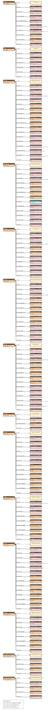
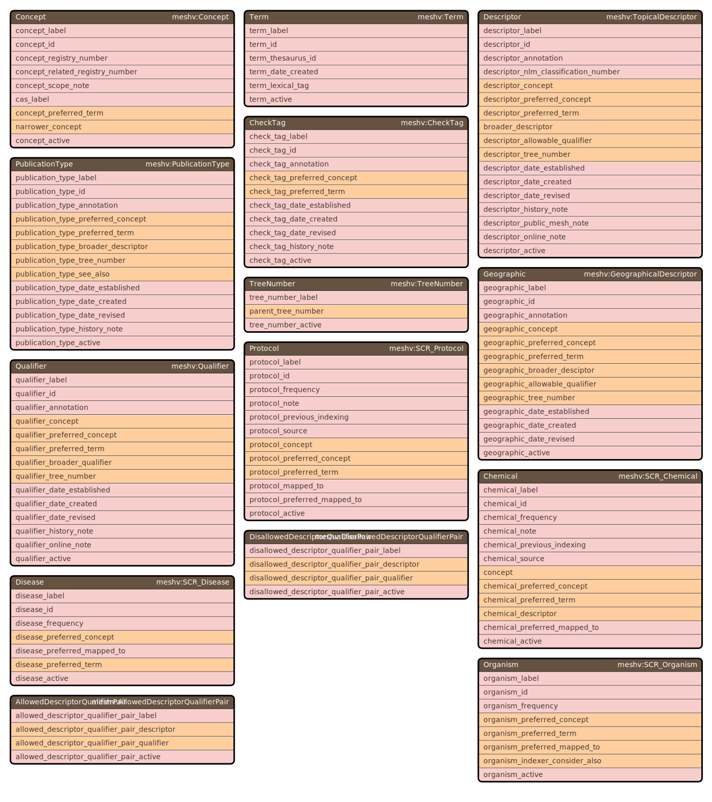
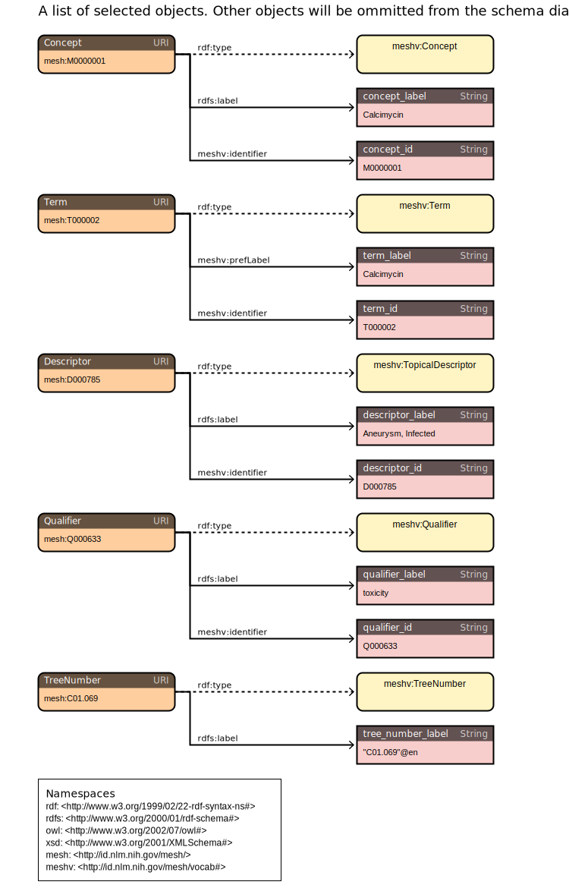
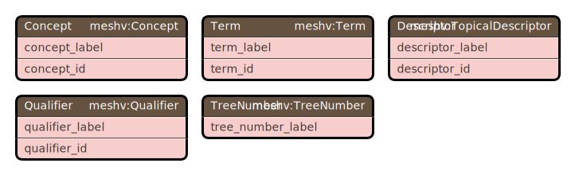
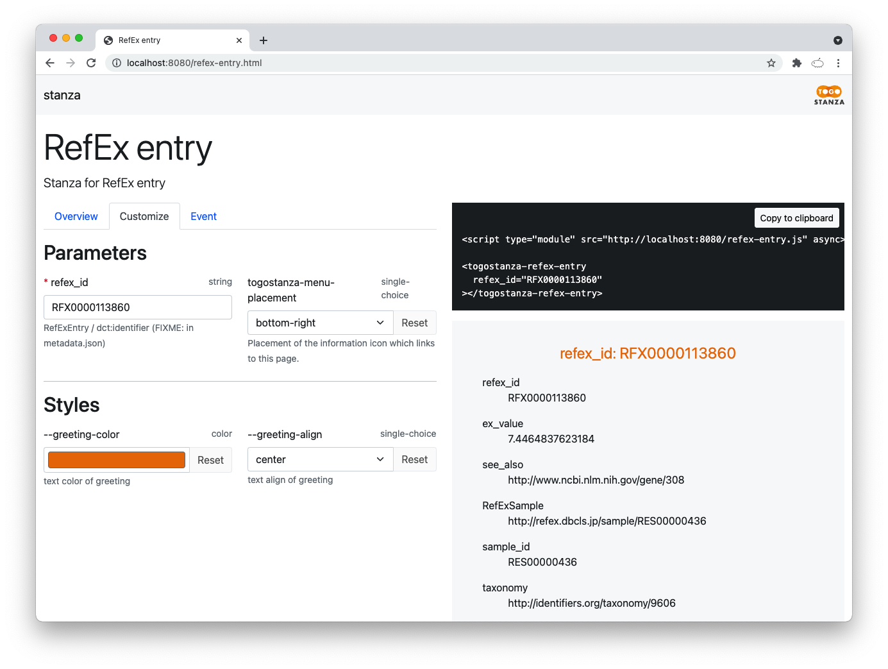

# RDF configの実行方法と実行オプション

## 実行方法

```
% rdf-config --config 設定ファイルのディレクトリ 実行オプション
```

--configオプションには、設定ファイルが保存されているディレクトリを指定する

## 実行オプション
| オプション | 実行される処理 |
----|----
| --sparql \[クエリ名:エンドポイント名\] | SPARQLクエリを標準出力に出力する。 |
| --schema \[スキーマ名:図の種類\] | RDFモデルのスキーマ図をSVG形式で標準出力に出力する。 |
| --senbero | RDFモデルの構造をテキスト形式で標準出力に出力する。 |
| --stanza \[Stanza ID\] | JavaScript版のStanzaファイル一式を生成する。<br />Node.jsがインストールされており、<br />npxコマンドのディレクトリがPATH環境変数に設定されている必要がある。 |
| --grasp | Graspの設定ファイル（GraphQLのスキーマファイルとクエリファイル）を生成する。<br />Graspの設定ファイルは、カレントディレクトリ配下の「grasp/設定ファイルディレクトリ名」というディレクトリに生成される。 |
| --shex | ShExを標準出力に出力する。 |

### オプションごとの設定名の表示

#### `--sparql`

```
% rdf-config --config config/db --sparql
```

のようにオプションを省略することで、下記のように設定可能なクエリ名のリストおよびエンドポイント名のリストが標準エラー出力に表示される。

```
Usage: --sparql query_name[:endpoint_name]
Available SPARQL query names: sparqlクエリ名1, sparqlクエリ名2
Available SPARQL endpoint names: endpoint名1, endpoint名2
```

#### `--schema`

schema.yaml が作られている場合、

```
% rdf-config --config config/db --schema
```

のようにオプションを省略することで、設定可能なスキーマ名のリストおよび指定可能な図の種類のリストが標準エラー出力に表示される。

```
Usage: --schema schema_name[:type]
Available schema names: schema名1, schema名2, schema名3
Avanlable schema types: nest, table, arc
```

schema.yaml がない場合、デフォルトのスキーマ図が生成される。

#### `--stanza`

```
% rdf-config --config config/db --stanza
```

のようにオプションを省略することで、下記のように設定可能なスタンザ名のリストが標準エラー出力に表示される。

```
Usage: --stanza stanza_name
Available stanza names: stanza名1, stanza名2
```

### SPARQLの生成について

SPARQL を生成するには、rdf-config に --sparql オプションを付けて実行する。

```
% rdf-config --config 設定ファイルのディレクトリ名 --sparql クエリ名:エンドポイント名
```

クエリ名には、sparql.yaml ファイルで設定したクエリを１つ選んで指定する。

エンドポイント名には、endpoint.yaml ファイルで設定したエンドポイントを１つ選んで指定する。

以下では、MeSH の [model.yaml](../config/mesh/model.yaml), [sparql.yaml](../config/mesh/sparql.yaml), [endpoint.yaml](../config/mesh/endpoint.yaml) を用いて実行例を示す。

例： MeSH の SPARQL 生成で、クエリ名 `sparql` とエンドポイント名 `endpoint` を使用

```
% rdf-config --config config/mesh --sparql sparql:endpoint
# Endpoint: https://id.nlm.nih.gov/mesh/sparql
# Description: Descriptor -> Concept -> Term, Descriptor -> Qualifier, Descriptor -> Term, Descriptor -> TreeNumber

PREFIX meshv: <http://id.nlm.nih.gov/mesh/vocab#>
PREFIX rdfs: <http://www.w3.org/2000/01/rdf-schema#>

SELECT ?descriptor_id ?descriptor_label ?concept_id ?concept_label ?term_id ?term_label ?qualifier_id ?qualifier_label ?tree_number_label
WHERE {
    ?Descriptor a meshv:TopicalDescriptor ;
        meshv:identifier ?descriptor_id ;
        rdfs:label ?descriptor_label ;
        meshv:concept / meshv:identifier ?concept_id ;
        meshv:concept / rdfs:label ?concept_label ;
        meshv:concept / meshv:preferredTerm / meshv:identifier ?term_id ;
        meshv:concept / meshv:preferredTerm / meshv:prefLabel ?term_label ;
        meshv:allowableQualifier / meshv:identifier ?qualifier_id ;
        meshv:allowableQualifier / rdfs:label ?qualifier_label ;
        meshv:treeNumber / rdfs:label ?tree_number_label .
}
LIMIT 100
```

例： クエリ名を `tree_pair` に、エンドポイント名を `med2rdf` に変更

```
% rdf-config --config config/mesh --sparql tree_pair:med2rdf
# Endpoint: http://sparql.med2rdf.org/sparql
# Description: 
# Parameter: parent_tree_number: (example: mesh:C01)

PREFIX meshv: <http://id.nlm.nih.gov/mesh/vocab#>
PREFIX mesh: <http://id.nlm.nih.gov/mesh/>

SELECT ?TreeNumber ?parent_tree_number
FROM <http://med2rdf.org/graph/mesh>
WHERE {
    VALUES ?parent_tree_number { mesh:C01 }
    ?TreeNumber a meshv:TreeNumber ;
        meshv:parentTreeNumber ?parent_tree_number .
    ?parent_tree_number a meshv:TreeNumber .
}
LIMIT 100
```

#### 変数に値を指定した SPARQL を生成する

sparql.yaml の parameters に指定されている変数に、デフォルト値以外の値を与えて SPARQL を生成する場合、「変数名=値」を追加する。

```
% rdf-config --config 設定ファイルのディレクトリ名 --sparql クエリ名:エンドポイント名 変数名=値 変数名2=値2
```

例： Ensembl で taxonomy ID をヒト (taxonomy:9606) からマウス (taxonomy:10090) に変更した SPARQL を生成

```
% rdf-config --config config/ensembl --sparql sparql ensg_taxonomy=taxonomy:10090
# Endpoint: https://integbio.jp/rdf/mirror/ebi/sparql
# Description: Ensembl gene and chromosome
# Parameter: ensg_taxonomy: (example: taxonomy:9606)

PREFIX obo: <http://purl.obolibrary.org/obo/>
PREFIX enso: <http://rdf.ebi.ac.uk/terms/ensembl/>
PREFIX dc: <http://purl.org/dc/elements/1.1/>
PREFIX rdfs: <http://www.w3.org/2000/01/rdf-schema#>
PREFIX faldo: <http://biohackathon.org/resource/faldo#>
PREFIX taxonomy: <http://identifiers.org/taxonomy/>

SELECT ?ensg_id ?ensg_label ?ensg_location ?ensg_taxonomy
FROM <http://rdf.ebi.ac.uk/dataset/ensembl/102/homo_sapiens>
WHERE {
    VALUES ?ensg_taxonomy { taxonomy:10090 }
    VALUES ?EnsemblGeneClass { obo:SO_0001217 enso:protein_coding }
    ?EnsemblGene a ?EnsemblGeneClass ;
        dc:identifier ?ensg_id ;
        rdfs:label ?ensg_label ;
        faldo:location ?ensg_location ;
        obo:RO_0002162 ?ensg_taxonomy .
}
LIMIT 100
```


### スキーマ図の生成について

スキーマ図を生成するには、rdf-config に --schema オプションを付けて実行する。

```
% rdf-config --config 設定ファイルのディレクトリ名 --schema スキーマ名:図の種類
```

図の種類には以下の3つの値を指定することができる。
- nest： ツリー構造のRDFスキーマ図が生成される。
- arc： 主語名が円周上に表示され、主語間で関係（主語が別の主語の目的語になっている）がベジエ曲線で結ばれた図が生成される。
- table： ER図のように、主語、述語、目的語がテーブル形式になった図が生成される。

図の種類が指定されていない場合は、各主語が1列に並んだ図が生成される。

スキーマ名には、schema.yaml ファイルで設定したスキーマ名を指定する。
スキーマ図に出力したい主語名、目的語名を schema.yaml ファイルに設定しておくことで、model.yaml ファイルに設定された全ての RDF トリプルではなく、スキーマ図のサブセットを生成することができる。

以下では、MeSH の [model.yaml](../config/mesh/model.yaml) と [schema.yaml](../config/mesh/schema.yaml) を用いて実行例を示す。

例： デフォルトで全ての主語と目的語を出力（タイトルは無し）

```
% rdf-config --config config/mesh --schema > mesh.svg
```


例： 主語間の関係を arc で表示

```
% rdf-config --config config/mesh --schema :arc > mesh_arc.svg
```


例： 各主語の目的語を表形式でコンパクトに表示

```
% rdf-config --config config/mesh --schema :table > mesh_table.svg
```


例：　タイトルだけ追加したスキーマ図を生成

```
% rdf-config --config config/mesh --schema title > mesh_title.svg
```
* [mesh_title.svg](./figure/mesh_title.svg)

例：　一部の主語だけを抜き出したスキーマ図を生成

```
% rdf-config --config config/mesh --schema main_subjects > mesh_main_subjects.svg
% rdf-config --config config/mesh --schema main_subjects:arc > mesh_main_subjects_arc.svg
% rdf-config --config config/mesh --schema main_subjects:table > mesh_main_subjects_table.svg
```
* [mesh_main_subjects.svg](./figure/mesh_main_subjects.svg)
* [mesh_main_subjects_arc.svg](./figure/mesh_main_subjects_arc.svg)
* [mesh_main_subjects_table.svg](./figure/mesh_main_subjects_table.svg)

例：　一部の目的語だけを抜き出したスキーマ図を生成

```
% rdf-config --config config/mesh --schema main_objects > mesh_main_objectss.svg
% rdf-config --config config/mesh --schema main_objects:arc > mesh_main_objects_arc.svg
% rdf-config --config config/mesh --schema main_objects:table > mesh_main_objects_table.svg
```





### スタンザの生成について

スタンザを生成するには、rdf-config に --stanza オプションを付けて実行する。

```
% rdf-config --config 設定ファイルのディレクトリ名 --stanza スタンザ名
```

生成されるスタンザは stanza.yaml で指定した `output_dir` に出力される。

例： RefEx のスタンザを生成

```
% rdf-config --config config/refex --stanza refex_entry
Generate stanza: refex_entry
Execute command: npx togostanza generate stanza refex_entry --label "RefEx entry" --definition "Stanza for RefEx entry"
? license (MIT):   # ← ライセンスを指定、リターンでデフォルトの MIT が選択される
? author (dbcls):  # ← 作成者名を指定
   create stanzas/refex-entry/README.md
   create stanzas/refex-entry/index.js
   create stanzas/refex-entry/style.scss
   create stanzas/refex-entry/assets/.keep
   create stanzas/refex-entry/templates/stanza.html.hbs

Stanza template has been generated successfully.
To view the stanza, run (cd stanza; npx togostanza serve) and open http://localhost:8080/
```

このあと、表示されている通りコマンドを実行し、

```
% cd stanza
% npx togostanza serve
```

ブラウザで http://localhost:8080/ 表示して確認する。



表示が確認できたら、生成されたスタンザを改変しカスタマイズなどを行う。

```
stanza/stanzas/refex-entry
|-- README.md
|-- assets                 # ← 表示に用いる追加の画像や静的ファイルはここに設置
|-- index.js               # ← 機能の追加は JavaScript ファイルを修正
|-- metadata.json          # ← メタデータは JSON ファイルを修正
|-- style.scss             # ← デザインの変更は CSS ファイルを修正
`-- templates
    |-- stanza.html.hbs    # ← 表示方法の変更は HTML ファイルを修正
    `-- stanza.rq.hbs      # ← クエリの改訂は SPARQL ファイルを修正
```


