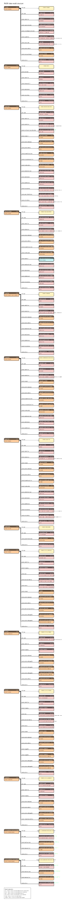
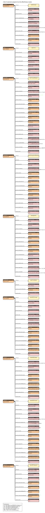
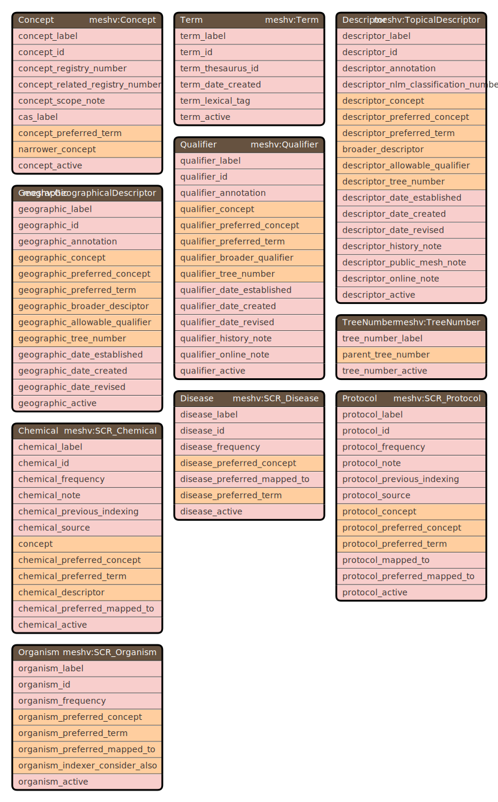

# RDF configの実行方法と実行オプション

## 実行方法
```
$ rdf-config --config 設定ファイルのディレクトリ 実行オプション
```

--configオプションには、設定ファイルが保存されているディレクトリを指定する

## 実行オプション
| オプション | 実行される処理 |
----|----
| --sparql \[クエリ名:エンドポイント名\] | SPARQLクエリを標準出力に出力する。 |
| --schema \[スキーマ名:図の種類\] | RDFモデルのスキーマ図をSVG形式で標準出力に出力する。 |
| --senbero | RDFモデルの構造をテキスト形式で標準出力に出力する。 |
| --stanza \[Stanza ID\] | JavaScript版のStanzaファイル一式を生成する。<br />tsコマンドがインストールされており、<br />tsコマンドがあるディレクトリがPATH環境変数に設定されている必要がある。 |
| --stanza_rb \[Stanza ID\] | Ruby版のTogoStanzaをセットアップし、Stanzaファイル一式を生成する。<br />TogoStanzaのgemがインストールされている必要がある。<br />また、togostanzaコマンドがあるディレクトリがPATH環境変数に設定されている必要がある。 |
| --grasp | Graspの設定ファイル（GraphQLのスキーマファイルとクエリファイル）を生成する。<br />Graspの設定ファイルは、カレントディレクトリ配下の「grasp/設定ファイルディレクトリ名」というディレクトリに生成される。 |
| --shex | ShExを標準出力に出力する。 |


### SPARQLの生成について

SPARQLを生成するには、rdf-configに --sparqlオプションを付けて実行する。

```
$ rdf-config --config 設定ファイルのディレクトリ名 --sparql [クエリ名:エンドポイント名]
```

クエリ名には、sparql.yamlファイルで設定したクエリを１つ選んで指定する。
クエリ名を省略した場合は デフォルトで sparql という名前のクエリが用いられる。

エンドポイント名には、endpoint.yamlファイルで設定したエンドポイントを１つ選んで指定する。
エンドポイント名を省略した場合は、デフォルトで endpoint という名前のエンドポイントが用いられる。

以下では、MeSH の [model.yaml](../config/mesh/model.yaml), [sparql.yaml](../config/mesh/sparql.yaml), [endpoint.yaml](../config/mesh/endpoint.yaml) を用いて実行例を示す。

例：デフォルトの sparql クエリと endpoint を使用

```
$ rdf-config --config config/mesh --sparql
# Endpoint: https://id.nlm.nih.gov/mesh/sparql
# Description: Descriptor -> Concept -> Term, Descriptor -> Qualifier, Descriptor -> Term, Descriptor -> TreeNumber

PREFIX meshv: <http://id.nlm.nih.gov/mesh/vocab#>
PREFIX rdfs: <http://www.w3.org/2000/01/rdf-schema#>

SELECT ?descriptor_id ?descriptor_label ?concept_id ?concept_label ?term_id ?term_label ?qualifier_id ?qualifier_label ?tree_number_label
WHERE {
    ?Descriptor a meshv:TopicalDescriptor ;
        meshv:identifier ?descriptor_id ;
        rdfs:label ?descriptor_label ;
        meshv:concept / meshv:identifier ?concept_id ;
        meshv:concept / rdfs:label ?concept_label ;
        meshv:concept / meshv:preferredTerm / meshv:identifier ?term_id ;
        meshv:concept / meshv:preferredTerm / meshv:prefLabel ?term_label ;
        meshv:allowableQualifier / meshv:identifier ?qualifier_id ;
        meshv:allowableQualifier / rdfs:label ?qualifier_label ;
        meshv:treeNumber / rdfs:label ?tree_number_label .
}
LIMIT 100
```

例：SPARQLクエリ名に tree_pair を指定

```
$ rdf-config --config config/mesh --sparql tree_pair
# Endpoint: https://id.nlm.nih.gov/mesh/sparql
# Description: 
# Parameter: parent_tree_number: (example: mesh:C01)

PREFIX meshv: <http://id.nlm.nih.gov/mesh/vocab#>
PREFIX mesh: <http://id.nlm.nih.gov/mesh/>

SELECT ?TreeNumber ?parent_tree_number
WHERE {
    VALUES ?parent_tree_number { mesh:C01 }
    ?TreeNumber a meshv:TreeNumber ;
        meshv:parentTreeNumber ?parent_tree_number .
    ?parent_tree_number a meshv:TreeNumber .
}
LIMIT 100
```

例：SPARQLエンドポイントを med2rdf に変更

```
$ rdf-config --config config/mesh --sparql :med2rdf
# Endpoint: http://sparql.med2rdf.org/sparql
# Description: Descriptor -> Concept -> Term, Descriptor -> Qualifier, Descriptor -> Term, Descriptor -> TreeNumber

PREFIX meshv: <http://id.nlm.nih.gov/mesh/vocab#>
PREFIX rdfs: <http://www.w3.org/2000/01/rdf-schema#>

SELECT ?descriptor_id ?descriptor_label ?concept_id ?concept_label ?term_id ?term_label ?qualifier_id ?qualifier_label ?tree_number_label
FROM <http://med2rdf.org/graph/mesh>
WHERE {
    ?Descriptor a meshv:TopicalDescriptor ;
        meshv:identifier ?descriptor_id ;
        rdfs:label ?descriptor_label ;
        meshv:concept / meshv:identifier ?concept_id ;
        meshv:concept / rdfs:label ?concept_label ;
        meshv:concept / meshv:preferredTerm / meshv:identifier ?term_id ;
        meshv:concept / meshv:preferredTerm / meshv:prefLabel ?term_label ;
        meshv:allowableQualifier / meshv:identifier ?qualifier_id ;
        meshv:allowableQualifier / rdfs:label ?qualifier_label ;
        meshv:treeNumber / rdfs:label ?tree_number_label .
}
LIMIT 100
```

例：クエリ名とエンドポイント名両方を指定

```
$ rdf-config --config config/mesh --sparql list_qual_for_desc:med2rdf
# Endpoint: http://sparql.med2rdf.org/sparql
# Description: 
# Parameter: qualifier_active: (example: true)
#            allowed_descriptor_qualifier_pair_active: (example: true)

PREFIX meshv: <http://id.nlm.nih.gov/mesh/vocab#>
PREFIX rdfs: <http://www.w3.org/2000/01/rdf-schema#>

SELECT ?AllowedDescriptorQualifierPair ?Qualifier ?qualifier_label
FROM <http://med2rdf.org/graph/mesh>
WHERE {
    VALUES ?qualifier_active { true }
    VALUES ?allowed_descriptor_qualifier_pair_active { true }
    ?Qualifier a meshv:Qualifier ;
        rdfs:label ?qualifier_label ;
        meshv:active ?qualifier_active .
    ?AllowedDescriptorQualifierPair a meshv:AllowedDescriptorQualifierPair ;
        meshv:active ?allowed_descriptor_qualifier_pair_active .
}
LIMIT 100
```

### スキーマ図（--schemaオプション）の生成について

スキーマ図を生成するには、rdf-configに --schemaオプションを付けて実行する。

```
$ rdf-config --config 設定ファイルのディレクトリ名 --schema [スキーマ名:図の種類]
```

図の種類には以下の3つの値を指定することができる。
- nest：ツリー構造のRDFスキーマ図が生成される。
- arc：主語名が円周上に表示され、主語間で関係（主語が別の主語の目的語になっている）がベジエ曲線で結ばれた図が生成される。
- table：ER図のように、主語、述語、目的語がテーブル形式になった図が生成される。

図の種類が指定されていない場合は、各主語が1列に並んだ図が生成される。

スキーマ名には、schema.yamlファイルで設定したスキーマ名を指定する。
スキーマ図に出力したい主語名、目的語名をschema.yamlファイルに設定しておくことで、model.yamlファイルに設定された全てのRDFトリプルではなく、スキーマ図のサブセットを生成することができる。

以下では、MeSH の [model.yaml](../config/mesh/model.yaml) と [schema.yaml](../config/mesh/schema.yaml) を用いて実行例を示す。

例：デフォルトで全ての主語と目的語を出力（タイトルは無し）

```
$ rdf-config --config config/mesh --schema > mesh.svg
```


例：主語間の関係を arc で表示

```
$ rdf-config --config config/mesh --schema :arc > mesh_arc.svg
```


例：各主語の目的語を表形式でコンパクトに表示

```
$ rdf-config --config config/mesh --schema :table > mesh_table.svg
```


例：タイトルだけ追加したスキーマ図を生成

```
$ rdf-config --config config/mesh --schema title > mesh_title.svg
```


例：一部の主語だけを抜き出したスキーマ図を生成

```
$ rdf-config --config config/mesh --schema main_subjects > mesh_main_subjects.svg
$ rdf-config --config config/mesh --schema main_subjects:arc > mesh_main_subjects_arc.svg
$ rdf-config --config config/mesh --schema main_subjects:table > mesh_main_subjects_table.svg
```




例：一部の目的語だけを抜き出したスキーマ図を生成

```
$ rdf-config --config config/mesh --schema main_objects > mesh_main_objectss.svg
$ rdf-config --config config/mesh --schema main_objects:arc > mesh_main_objects_arc.svg
$ rdf-config --config config/mesh --schema main_objects:table > mesh_main_objects_table.svg
```


